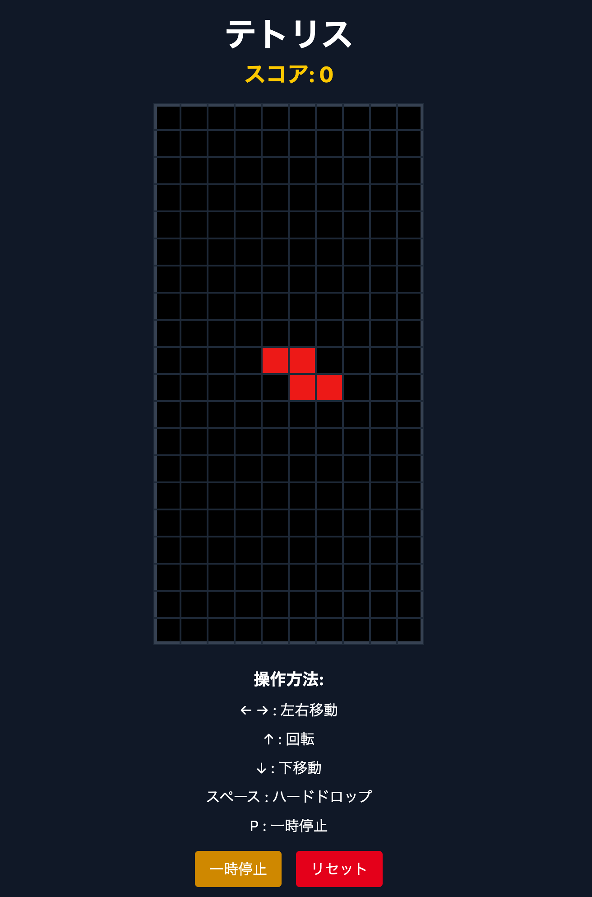
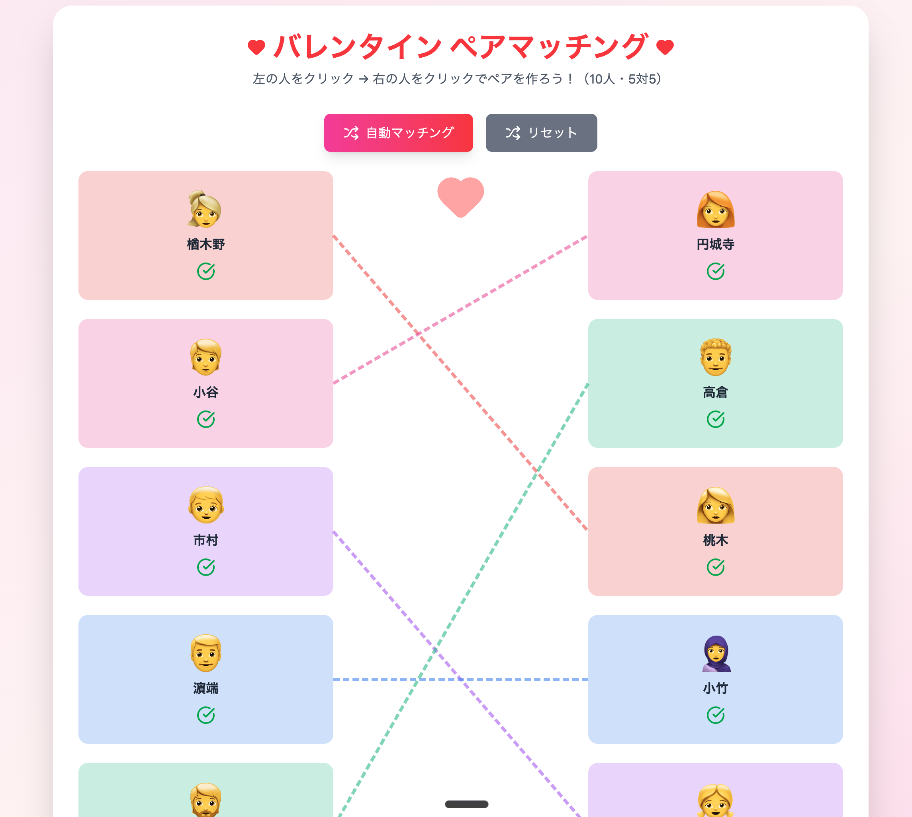

Tetris


Valentine_matching



Minecraft


## 起動方法

各ゲームは独立したNode.jsプロジェクト（Vite）。それぞれのディレクトリで依存パッケージをインストールしてから起動する。

```bash
cd Minecraft   # または Tetris, Valentine_matching/valentine-game
npm install
npm run dev
```

- `Minecraft/` — Three.js製の簡易Minecraft風ゲーム
- `Tetris/` — テトリス
- `Valentine_matching/valentine-game/` — バレンタイン向けマッチングゲーム

`npm run dev` を実行するとローカル開発サーバーが起動するので、表示されたURL（例: `http://localhost:5173`）をブラウザで開いて遊ぶ。

## node_modules の復元について

**Phase 4でこれら3プロジェクトの `node_modules/` は削除される予定。** `package.json` + `package-lock.json` から機械的に復元できるため、遊ぶ前に上記の `npm install` を実行すればよい。